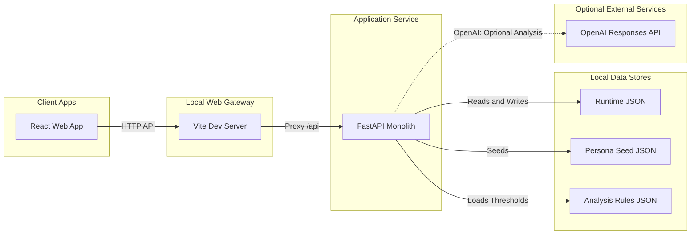

# 자립동행 MVP 시스템 동작 설명서

이 문서는 `docs/기능명세서.md`의 F1~F7을 로컬 시연용 웹 애플리케이션으로 구현한 현재 구조와 실행 방법을 설명한다. 화면은 `Social Impact Service UI_UX (복사)`의 Figma Make 소스와 디자인 토큰을 유지하고, 하드코딩된 업무 데이터를 FastAPI와 JSON 저장소로 교체했다.

## 1. 구현 범위

| 기능 | 구현 내용 |
|---|---|
| F1 오늘의 안부 | 청년용 안부 카드 UI를 로컬 웹에서 표시 |
| F2 응답 입력 | 기분, 체크 항목, 자유 메모를 `POST /api/checkins`로 저장 |
| F3 데이터 축적 | 12명·720건 시드 데이터와 신규 응답을 서버 JSON에 영속화하고 지표 계산 |
| F4 상태 분석 | 설정 기반 규칙 분석, 선택적 AI 분석, 혼합 분석과 자동 규칙 폴백 |
| F5 알림 | 비정상 분석 결과로 알림 생성·갱신, 확인 처리 |
| F6 로그인·목록 | 데모 로그인 API, 청년 목록·검색·상태 필터·알림 배지 |
| F7 상세 | 프로필, 응답률 추이, 최근 응답, 판정 근거, 처리 상태·메모 저장 |

F8 문서 자동화, F9 지원 제도 매칭, 실인증, 외부 메시지, 운영 배포는 구현 범위가 아니다.

## 2. 전체 구조



- 프런트엔드: React 19, TypeScript, Vite, Tailwind CSS, Recharts
- 백엔드: FastAPI, Pydantic, Uvicorn
- 저장소: `backend/data/app_data.json`
- 초기 데이터: `data/personas/personas.json`
- 분석 설정: `backend/config/analysis_rules.json`
- 기본 주소: 프런트엔드 `http://127.0.0.1:8443`, 백엔드 `http://127.0.0.1:8000`

브라우저는 `/api` 상대 경로만 호출한다. 개발 중 Vite가 이를 FastAPI의 8000 포트로 전달하므로 API 주소가 화면 코드 곳곳에 흩어지지 않는다.

## 3. 주요 디렉터리

```text
backend/
  app/
    analysis/          규칙·AI·혼합 분석 엔진
    api/               HTTP 라우트
    auth/              교체 가능한 데모 인증 의존성
    repositories/      저장소 인터페이스와 JSON 구현체
    schemas/           Pydantic 데이터 계약
    services/          시드, 지표 계산, 업무 흐름
    main.py             FastAPI 앱 생성
    seed.py             데이터 초기화 진입점
  config/               분석 기준 JSON
  data/                 실행 중 생성되는 JSON
  tests/                API·지표·저장 안전성 테스트
Social Impact Service UI_UX (복사)/
  src/lib/api.ts        프런트엔드 API 경계
  src/types.ts          서버 응답 타입
  src/screens/          기존 디자인 기반 화면
scripts/
  dev.bat               Python 개발 서버 실행 진입점
  reset-demo.bat        Python 초기화 진입점
  smoke-test.bat        Python 점검 진입점
manage.py               실행·초기화·HTTP 점검 통합 Python CLI
```

## 4. 시작과 종료

### 최초 한 번 설치

저장소 루트에서 실행한다.

```powershell
python -m venv .venv
.\.venv\Scripts\python.exe -m pip install -r .\backend\requirements-dev.txt
Push-Location '.\Social Impact Service UI_UX (복사)'
npm.cmd install
Pop-Location
```

Python으로 직접 실행한다.

```powershell
.\.venv\Scripts\python.exe .\manage.py dev
```

또는 다음 BAT 파일을 실행한다. 탐색기에서 `scripts/dev.bat`을 더블클릭해도 된다.

```bat
scripts\dev.bat
```

BAT 파일도 PowerShell을 사용하지 않고 프로젝트 가상환경의 Python으로 `manage.py`를 호출한다. Python 런처는 백엔드를 먼저 시작하고 health check가 성공한 뒤 Vite를 실행한다. `Ctrl+C` 또는 Vite의 `q`로 종료하면 자신이 시작한 프런트엔드와 백엔드 프로세스 트리도 정리한다.

API 명세 UI는 `http://127.0.0.1:8000/docs`에서 확인할 수 있다.

### 데이터 초기화

```bat
scripts\reset-demo.bat
```

Python 직접 실행은 `.\.venv\Scripts\python.exe .\manage.py reset`이다.

현재 런타임 데이터를 시드 상태로 다시 만들며 기존 JSON은 `.bak` 파일로 한 번 백업된다. 서버 실행 중 초기화하지 않는 것을 권장한다.

## 5. 데이터 저장 방식

### 시작 시 시드

FastAPI lifespan이 시작될 때 런타임 JSON이 없으면 `personas.json`을 읽어 다음 컬렉션으로 정규화한다.

- `youths`: 청년 기본 정보
- `checkins`: 발송·응답 원시 로그
- `metrics`: 청년별 최신 계산 지표
- `assessments`: 시간순 분석 이력
- `alerts`: 비정상 판정에 대한 알림과 처리 상태
- `caseActions`: 전담요원 처리 상태와 메모

초기화 직후 각 청년에 대해 규칙 분석을 수행하여 목록·상세·알림 화면이 즉시 동작한다. 청년 상세를 열면 저장된 분석의 모드가 현재 `ANALYSIS_MODE`와 다른 경우에만 설정된 모드로 다시 분석한다. 이 방식으로 목록 조회와 청년 응답 저장에서는 AI 호출 비용이 발생하지 않는다. 키가 없거나 호출에 실패하면 규칙 분석으로 폴백한다.

### 안전한 JSON 쓰기

`JsonDataRepository`는 한 프로세스 안에서 재진입 잠금으로 읽기-수정-쓰기를 묶는다. 저장 시 다음 순서를 사용한다.

1. Pydantic `AppStore`로 전체 구조를 검증한다.
2. 기존 파일이 있으면 `app_data.json.bak`으로 복사한다.
3. 같은 디렉터리에 임시 파일을 만들고 UTF-8 JSON을 기록한다.
4. 파일 버퍼를 디스크에 동기화한다.
5. `os.replace`로 원본을 원자적으로 교체한다.

쓰기 실패 시 교체 전 원본은 유지된다. 이 방식은 로컬 단일 프로세스 MVP를 위한 것이며 여러 서버 프로세스의 동시 쓰기를 보장하지 않는다.

## 6. 핵심 동작 흐름

### 청년 응답

1. 첫 화면에서 `청년` 유형을 선택하고 로그인한다.
2. 로그인 응답의 `youthId`에 해당하는 오늘의 안부 설문으로 이동한다.
3. 기분을 선택하고 선택 항목과 메모를 입력하면 프런트엔드가 `POST /api/checkins`를 호출한다.
4. 서버는 같은 청년·같은 날짜의 기존 응답을 최신 제출로 교체한다.
5. 원시 응답을 저장한 뒤 지표를 다시 계산하고 분석기를 실행한다.
6. 비정상 결과라면 열린 알림을 갱신하거나 새 알림을 만든다.
7. 저장이 끝난 경우에만 완료 화면으로 이동한다. 실패하면 입력 화면에 오류를 표시한다.

### 전담요원 목록과 상세

1. 데모 로그인 성공 시 받은 토큰은 프런트엔드 API 모듈 메모리에 보관한다.
2. 목록 화면은 검색어와 상태 필터를 API 쿼리로 전달한다.
3. 청년 ID를 선택하면 상세 API에서 프로필, 지표, 최신 판정, 응답, 조치 이력을 먼저 받는다. 이어 판단 근거 카드만 별도 API로 현재 설정 모드에 맞춰 재분석한다.
4. `상태 다시 분석`은 선택된 분석 모드로 새 판정을 저장한다.
5. 처리 상태와 메모 저장은 `caseActions`에 이력을 추가하고 열린 알림의 상태도 함께 갱신한다.

### 알림

- 판정이 `정상`이 아니면 알림 대상이다.
- 같은 청년에게 `미확인` 또는 `관찰지속` 알림이 있으면 중복 생성 대신 최신 근거로 갱신한다.
- 알림 화면의 `확인 처리`는 해당 알림을 `확인완료`로 변경한다.
- 상세 화면의 조치 저장은 `확인완료`, `연락필요`, `관찰지속` 중 하나를 기록한다.

## 7. 지표 계산과 규칙 판정

기간 계산은 서버의 현재 날짜가 아니라 해당 청년의 가장 최신 발송 로그 날짜를 기준으로 한다. 따라서 과거 시뮬레이션 데이터도 일관되게 시연할 수 있다.

| 지표 | 계산 방식 |
|---|---|
| 전체 응답률 | 전체 발송 중 응답 건수 비율 |
| 최근 7일 응답률 | 최신 발송일 포함 7일 |
| 직전 7일 응답률 | 최근 구간 직전 7일 |
| 응답률 변화 | 최근 7일 응답률 - 직전 7일 응답률 |
| 연속 미응답 | 최신 로그부터 거꾸로 센 미응답 일수 |
| 최대 미응답 | 전체 구간에서 가장 긴 연속 미응답 |
| 평균 응답 시간 | 응답 완료 로그의 분 단위 평균 |
| 기분 변화 | 기분 선택을 1~4점으로 변환한 두 7일 구간 평균 차이 |

기본 규칙은 `analysis_rules.json`에서 수정한다.

- `관심 필요`: 최근 응답률 59% 이하, 3일 이상 연속 미응답, 응답률 40%p 이상 하락, 기분 평균 1점 이상 하락 중 하나
- `훼손 의심`: 최근 응답률 29% 이하, 5일 이상 연속 미응답, 응답률 65%p 이상 하락 중 하나

더 높은 단계의 조건을 먼저 적용한다. 이 라벨은 의료 진단이나 확정 위험등급이 아니며 전담요원이 확인할 상태 변화를 선별하는 참고값이다.

## 8. AI 확장 구조

`AssessmentEngine` 인터페이스가 지표와 최근 응답을 받아 동일한 구조의 결과를 반환한다. 실행 모드는 환경변수 `ANALYSIS_MODE` 또는 분석 API의 `mode`로 선택한다.

| 모드 | 동작 |
|---|---|
| `rule` | JSON 임계값 기반 규칙 엔진만 실행 |
| `ai` | AI 결과 사용, 호출 불가 시 규칙으로 폴백 |
| `hybrid` | 규칙과 AI를 모두 실행하고 더 주의가 필요한 라벨을 사용 |

`AI_API_KEY`가 비어 있거나 API 호출·응답 검증에 실패하면 요청 자체를 실패시키지 않고 `rule-fallback` 분석 결과를 저장한다. 상세 화면은 현재 폴백 상태를 명시한다. 키는 백엔드 `.env`에서만 읽으며 브라우저 번들에 포함하지 않는다.

AI 어댑터는 Responses API의 JSON Schema 구조화 출력을 요청하고, Pydantic으로 다시 검증한다. AI에는 계산 지표와 최근 14일의 응답 여부·기분·자유 메모·응답 시간·일상 체크 항목(식사, 수면, 외출, 대화)을 전달한다. 일상 체크 항목은 시드의 각 `daily_logs.follow_ups`와 신규 응답의 `followUps`에 보존된다. AI 근거는 지표명만 나열하지 않고 입력값의 수치·단위를 포함한 한국어 문장 1~3개로 반환하도록 요청한다. 화면에는 AI 요약과 그 수치 근거 목록을 함께 표시한다. 다른 제공자를 붙일 때는 새 엔진이 `AssessmentEngine` 계약을 구현하도록 추가하면 저장·알림·화면 코드는 유지할 수 있다.

예시 설정:

```powershell
Copy-Item .\backend\.env.example .\backend\.env
# backend/.env에 AI_API_KEY를 입력하고 ANALYSIS_MODE=hybrid 유지
```

## 9. 인증 확장 구조

현재 로그인은 로컬 UI 흐름 확인용이다. 아이디와 비밀번호가 비어 있지 않으면 선택한 역할에 따라 고정 청년 사용자 또는 고정 전담요원과 토큰을 반환한다. 프런트엔드는 역할에 따라 청년 설문 흐름과 관리자 업무 화면을 분리한다. 보호 API는 `get_current_user` 의존성을 사용한다. 데모 편의를 위해 헤더가 없을 때도 고정 전담요원을 허용하지만, 잘못된 Bearer 토큰은 401로 거부한다.

실제 인증을 붙일 때의 교체 지점은 다음 두 곳이다.

1. 백엔드 `app/auth/demo.py`의 로그인과 `get_current_user`를 외부 OAuth/OIDC 또는 인증 서비스 검증으로 교체한다.
2. 프런트엔드 `src/lib/api.ts`의 토큰 공급 방식을 메모리 토큰에서 외부 인증 SDK의 토큰 조회로 교체한다.

업무 API와 화면은 모두 사용자 ID 대신 인증 의존성이 반환하는 사용자 객체를 사용하므로 이 교체를 위해 데이터 저장 로직을 다시 작성할 필요가 없다.

## 10. API 요약

| 메서드 | 경로 | 설명 |
|---|---|---|
| GET | `/api/health` | 서버·저장 방식·데모 모드 확인 |
| POST | `/api/auth/login` | 데모 토큰과 사용자 반환 |
| GET | `/api/auth/me` | 현재 사용자 확인 |
| GET | `/api/youths?query=&status=` | 목록 검색과 상태 필터 |
| GET | `/api/youths/{youthId}` | 프로필·지표·판정·응답·조치 통합 상세 |
| POST | `/api/youths/{youthId}/analysis/current` | 현재 분석 모드 결과가 없을 때만 상세 판단 근거 재분석 |
| GET | `/api/youths/{youthId}/checkins` | 원시 안부 기록 |
| POST | `/api/checkins` | 오늘 안부 응답 저장 후 재분석 |
| GET | `/api/alerts` | 최신순 알림 목록 |
| PATCH | `/api/alerts/{alertId}` | 알림 처리 상태 갱신 |
| GET | `/api/youths/{youthId}/actions` | 조치 이력 조회 |
| POST | `/api/youths/{youthId}/actions` | 처리 상태와 메모 저장 |
| POST | `/api/youths/{youthId}/analyze` | `rule`, `ai`, `hybrid` 재분석 |

Pydantic이 요청을 검증하여 잘못된 열거값·누락 필드는 422를 반환한다. 없는 청년이나 알림은 404, 잘못된 데모 토큰은 401이다.

## 11. 검증 방법

백엔드 자동 테스트:

```powershell
Push-Location .\backend
..\.venv\Scripts\python.exe -m pytest
Pop-Location
```

프런트엔드 타입 검사와 빌드:

```powershell
Push-Location '.\Social Impact Service UI_UX (복사)'
npx.cmd tsc --noEmit
npm.cmd run build
Pop-Location
```

서버 실행 중 실제 HTTP 흐름 점검:

```bat
scripts\smoke-test.bat
```

Python 직접 실행은 `.\.venv\Scripts\python.exe .\manage.py smoke`이다.

스모크 테스트는 health, 로그인, 목록, 상세, 응답 저장, 규칙 분석, 조치 저장을 순서대로 호출하므로 런타임 JSON이 바뀐다. 시연 전에는 `reset-demo.bat`을 다시 실행한다.

## 12. 현재 제약과 다음 확장 순서

- JSON 저장소는 단일 로컬 서버 프로세스만 전제로 한다.
- 로그인은 실제 자격 증명을 검증하지 않는다.
- 청년 데모 계정은 시드 데이터의 `P02`와 연결된다. 실제 인증 도입 시 외부 인증 사용자의 청년 ID 매핑으로 교체한다.
- F1은 발송 스케줄러가 아니라 오늘의 메시지 카드 UI다.
- AI 키가 없으면 비용과 네트워크 없이 규칙 모드로 완전 동작한다.
- AI에 전달되는 자유 텍스트에는 실제 개인정보가 포함될 수 있으므로 운영 전 동의, 비식별화, 보관 정책 검토가 필요하다.

권장 확장 순서는 실제 인증 공급자 연결, Repository 구현을 SQLite/PostgreSQL로 교체, 청년별 접근제어, 외부 메시지 연동, 운영 관측·감사 로그 순이다.
